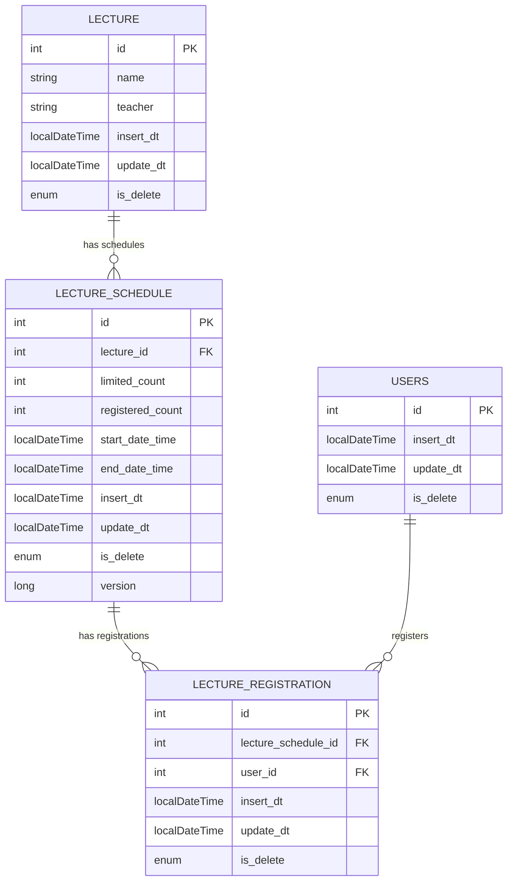

## 특강 신청 서비스

**[ 요구사항 ]**

- [X] POST `/lectures/apply` : 특강 신청 API
    - [X] 동일한 신청자는 한 번의 수강 신청만 성공할 수 있다.
    - [X] 선착순 30명안에 신청하지 못한 신청자는 요청에 실패한다.

- [X] GET `/lectures/application/{userId}` : 특강 신청 완료 목록 조회 API
    - [X] 특정 userId 로 신청 완료된 특강 목록을 조회한다.
    - [X] 각 항목은 특강 ID 및 이름, 강연자 정보를 담고 있어야 한다.

- [X] GET `/lectures` : 특강 선택 API
    - [X] 날짜별로 현재 신청 가능한 특강 목록을 조회한다.
    - [X] 특강의 정원은 30명으로 고정이며, 사용자는 각 특강에 신청하기전 목록을 조회해볼 수 있다.

- [X] POST `/lectures/add` : 특강 등록 API
    - [X] 특강을 등록 할 수 있다.

- [X] POST `/lectures/schedule/add` : 특강 스케쥴 등록 API
    - [X] 특강 스케쥴을 등록할 수 있다.

**[ ERD ]**

**[ DB 설계 ]**

### 1. `LECTURE` 테이블 (특강 테이블)

- **설계 이유**: `LECTURE` 테이블은 특강(강의)의 기본 정보를 저장합니다. 이 테이블은 각 강의를 고유하게 식별하고, 이름과 생성/수정 날짜, 삭제 여부를 관리하여 특강에 대한 메타 정보를 유지합니다.

- **컬럼 설명**:
    - `id` (PK): 각 강의를 고유하게 식별하는 기본 키입니다.
    - `name`: 강의 이름을 저장하는 컬럼입니다.
    - `teacher`: 강사 이름을 저장하는 컬럼입니다.
    - `insert_dt`: 강의가 생성된 시간을 기록하는 컬럼입니다.
    - `update_dt`: 강의가 마지막으로 수정된 시간을 기록하는 컬럼입니다.
    - `is_delete`: 강의의 삭제 여부를 나타내는 열로, enum 타입이며 삭제 시 'Y', 유지 시 'N' 값을 가집니다.

### 2. `LECTURE_SCHEDULE` 테이블 (특강 일정 테이블)

- **설계 이유**: `LECTURE_SCHEDULE` 테이블은 각 강의의 세부 일정을 관리합니다. 특정 강의의 시작 및 종료 시간, 등록 가능 인원 등의 정보를 저장하며, 동시에 낙관적 락을 적용하여 동시성
  제어를 지원합니다.

- **컬럼 설명**:
    - `id` (PK): 특강 일정을 식별하는 기본 키입니다.
    - `lecture_id` (FK): 해당 일정이 속하는 특강을 식별하는 외래 키입니다.
    - `limited_count`: 등록 가능한 최대 인원을 저장합니다.
    - `registered_count`: 현재까지 등록된 인원을 저장합니다.
    - `start_date_time`: 특강이 시작되는 시간을 저장합니다.
    - `end_date_time`: 특강이 종료되는 시간을 저장합니다.
    - `insert_dt`: 특강 일정이 생성된 시간을 기록하는 컬럼입니다.
    - `update_dt`: 특강 일정이 마지막으로 수정된 시간을 기록하는 컬럼입니다.
    - `is_delete`: 특강 일정의 삭제 여부를 나타내는 열로, enum 타입이며 삭제 시 'Y', 유지 시 'N' 값을 가집니다.
    - `version`: 낙관적 락을 위한 버전 관리 컬럼입니다.

### 3. `LECTURE_REGISTRATION` 테이블 (특강 신청 테이블)

- **설계 이유**: `LECTURE_REGISTRATION` 테이블은 사용자가 특강 일정에 등록한 정보를 저장합니다. 이 테이블을 통해 특정 사용자가 어떤 강의에 등록했는지를 관리할 수 있습니다.

- **컬럼 설명**:
    - `id` (PK): 각 신청 정보를 식별하는 기본 키입니다.
    - `lecture_schedule_id` (FK): 해당 신청이 속하는 강의 일정을 식별하는 외래 키입니다.
    - `user_id` (FK): 해당 신청을 한 사용자를 식별하는 외래 키입니다.
    - `insert_dt`: 신청이 생성된 시간을 기록하는 컬럼입니다.
    - `update_dt`: 신청 정보가 마지막으로 수정된 시간을 기록하는 컬럼입니다.
    - `is_delete`: 신청 정보의 삭제 여부를 나타내는 열로, enum 타입이며 삭제 시 'Y', 유지 시 'N' 값을 가집니다.

### 4. `USERS` 테이블 (사용자 테이블)

- **설계 이유**: `USERS` 테이블은 시스템에서 사용자 정보를 관리합니다. 각 사용자의 생성/수정 시간 및 삭제 여부를 기록하여 사용자 관리를 지원합니다.

- **컬럼 설명**:
    - `id` (PK): 각 사용자를 고유하게 식별하는 기본 키입니다.
    - `insert_dt`: 사용자가 생성된 시간을 기록하는 컬럼입니다.
    - `update_dt`: 사용자가 마지막으로 수정된 시간을 기록하는 컬럼입니다.
    - `is_delete`: 사용자의 삭제 여부를 나타내는 열로, enum 타입이며 삭제 시 'Y', 유지 시 'N' 값을 가집니다.